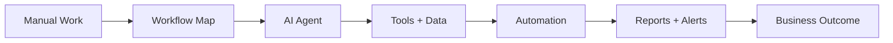

<!-- Profile README for ramvadlamudi22-dev -->

<div align="center">


<br /><br />


### Practical AI systems for real-world business operations.

[](https://ramvadlamudi22-dev.github.io)
[](https://t.me/leonv26)
[](https://github.com/ramvadlamudi22-dev)

</div>

---

## 🧠 Who I Am

I'm **Vadlamudi Ramana Babu**, an **AI Automation & Agent Builder** focused on shipping useful systems fast.

I build AI-powered workflows that help businesses save time, recover leads, automate support, process documents, and run repeatable operations without manual effort.

```txt
Manual workflow → AI agent → automated system → measurable output
```

- 🤖 Building AI agents, bots, browser agents, and workflow automations
- 📈 Focused on sales automation, lead recovery, support, scheduling, and back-office ops
- 🧾 Creating document extraction and data-processing systems for business use cases
- 🧪 Exploring LLM evaluations, prompt testing, and AI quality workflows
- 🚀 Turning ideas into MVPs, demos, launch-ready tools, and productized services

---

## ⚡ What I Can Build For You

<table>
  <tr>
    <td width="50%">
      <h3>🤖 AI Assistants & Chatbots</h3>
      <p>Telegram bots, WhatsApp agents, website chatbots, internal assistants, memory, tool calls, and human handoff flows.</p>
    </td>
    <td width="50%">
      <h3>📈 AI SDR & Lead Automation</h3>
      <p>Lead qualification, outbound workflows, follow-ups, proposal generation, CRM updates, and hot-lead alerts.</p>
    </td>
  </tr>
  <tr>
    <td width="50%">
      <h3>🧾 Document Extraction Systems</h3>
      <p>PDF, invoice, resume, form, insurance, and business document extraction into clean structured data.</p>
    </td>
    <td width="50%">
      <h3>🌐 Browser & Research Agents</h3>
      <p>Automated research, website monitoring, repetitive browser tasks, data entry, compliance checks, and reports.</p>
    </td>
  </tr>
  <tr>
    <td width="50%">
      <h3>🧠 LLM Evaluation Workflows</h3>
      <p>Prompt tests, output scoring, model comparison, regression checks, and quality monitoring for AI products.</p>
    </td>
    <td width="50%">
      <h3>🚀 AI MVP / Agency Systems</h3>
      <p>Fast AI product prototypes, landing pages, backend workflows, dashboards, and productized automation stacks.</p>
    </td>
  </tr>
</table>

---

## 🧰 Tech Stack

<div align="center">

### AI, Agents & Automation


### Web, Apps & Deployment


### Business Automation


</div>

---

## 🏗️ Featured Build Directions

| Project | Category | Business Use Case | Link |
|---|---|---|---|
| 🎙️ **Voice AI Receptionist** | Voice AI | Intake, FAQs, booking, call handling | [Repo](https://github.com/ramvadlamudi22-dev/voice-ai-receptionist) |
| 📈 **AI SDR Outbound System** | Sales AI | Lead qualification, outreach, follow-up | [Repo](https://github.com/ramvadlamudi22-dev/ai-sdr-outbound-system) |
| 🔁 **Lead Recovery Automation** | Revenue Ops | Recover lost leads and missed opportunities | [Repo](https://github.com/ramvadlamudi22-dev/lead-recovery-automation) |
| 💬 **WhatsApp Business Agents** | Messaging AI | Customer replies, lead capture, support | [Repo](https://github.com/ramvadlamudi22-dev/whatsapp-business-agents) |
| 🧾 **Document Extraction Engine** | Data Ops | Extract structured data from business docs | [Repo](https://github.com/ramvadlamudi22-dev/document-extraction-engine) |
| 🧠 **LLM Evals Observability** | AI Quality | Test prompts, score outputs, monitor AI | [Repo](https://github.com/ramvadlamudi22-dev/llm-evals-observability) |
| 🏢 **AI Automation Agency Stack** | Productized Service | Reusable delivery stack for client work | [Repo](https://github.com/ramvadlamudi22-dev/ai-automation-agency-stack) |
| 🔍 **Competitive Intelligence AI** | Research AI | Market monitoring and competitor tracking | [Repo](https://github.com/ramvadlamudi22-dev/competitive-intelligence-ai) |

---

## 📊 GitHub Dashboard

<div align="center">


<br /><br />


<br /><br />


</div>

---

## 🏆 Trophy Wall

<div align="center">


</div>

---

## 🧩 How I Think About Automation



> I don't just build bots. I build systems that connect inputs, decisions, actions, and measurable outcomes.

---

## 🎯 Current Focus

```yaml
building:
  - AI agents for business workflows
  - lead recovery and sales automation systems
  - document extraction and back-office automation
  - LLM evaluation and observability tools
  - browser agents for research and operations

open_to:
  - AI automation projects
  - MVP builds
  - bot development
  - workflow automation
  - collaboration on practical AI tools
```

---

## 🤝 Let's Connect

<div align="center">

### Have a workflow you want to automate?

Send me the manual steps, the desired output, and where the result should go.  
I'll help turn it into an AI agent, bot, or automation system.

<br />

[](https://t.me/leonv26)
[](https://ramvadlamudi22-dev.github.io)
[](https://github.com/ramvadlamudi22-dev)

<br /><br />


</div>
